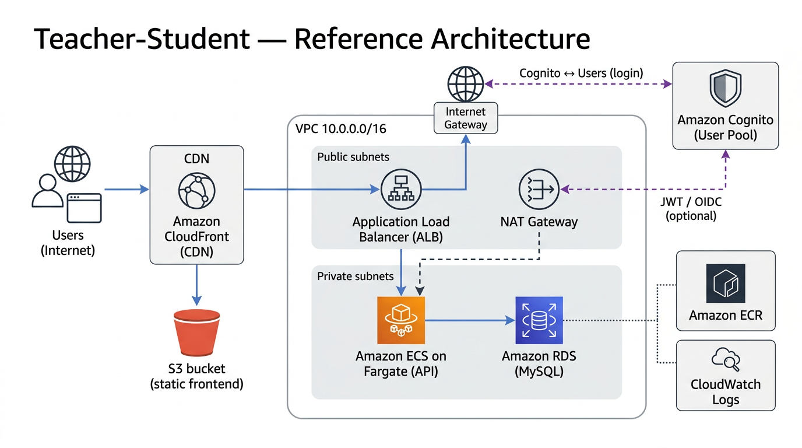

# Teacher-Student API

Node.js + TypeScript API for teacher-student administrative operations.

## Documentation

Supplementary guides live under [`docs/`](./docs/). Full index: **[docs/README.md](./docs/README.md)**.

| Document | Description |
|----------|-------------|
| [Product & API requirements](./requirements.md) | Assignment specification: endpoints, validation, and business rules for this API |
| [AWS deployment — architecture, Cognito, CDK](./docs/aws-cognito-ecs-deployment.md) | Target reference diagram, data flows (CloudFront/S3, ALB, ECS, RDS, Cognito), **`infra/cdk`** layout, `context`, checklist |
| [AWS deploy scripts (ECR + ECS)](./docs/aws-deploy-scripts.md) | Two-phase deploy: **`deploy-infra.sh`** then **`deploy-app.sh`**, or **`deploy-all.sh`** |
| [Current stack flows (Mermaid)](./docs/aws-current-stack-flows.md) | **Implemented** topology, HTTP path, container startup, infra vs image phases — matches `TeacherStudentStack` |
| [AWS CDK — risks and mitigations](./docs/aws-cdk-risks-and-mitigations.md) | Production risks (migrations, ECR tags, HTTP-only ALB, NAT, secrets) and mitigations |
| [Deployment screenshots](./docs/result.md) | Swagger UI on ALB, CloudFormation stack resources, ECS service logs |

### AWS: CDK + ECR (quick start)

**1 — Infrastructure** (AWS CLI + Node; **no Docker**). From the **repository root**:

```bash
export CDK_DEFAULT_ACCOUNT=123456789012
export CDK_DEFAULT_REGION=ap-southeast-1
(cd infra/cdk && npm install && npx cdk bootstrap)   # once per account/region
./scripts/aws/deploy-infra.sh
```

**2 — Application image** (requires **Docker**): build, push to the stack’s **ECR**, force new ECS deployment, wait until stable.

```bash
./scripts/aws/deploy-app.sh
```

**One command** (runs 1 then 2):

```bash
./scripts/aws/deploy-all.sh
```

Details: [`docs/aws-deploy-scripts.md`](./docs/aws-deploy-scripts.md), [`scripts/aws/README.md`](./scripts/aws/README.md). Migrations run on container start ([`scripts/docker-entrypoint.sh`](./scripts/docker-entrypoint.sh)). After the service is stable, open stack output **`ApiUrl`**.

### Reference architecture (target vs current CDK)

The diagram below is the **long-term target** (static site on CloudFront/S3, Cognito). The CDK stack in this repo implements **VPC, ALB, ECS Fargate, RDS MySQL, ECR (app repository), CloudWatch Logs**; CloudFront, S3, and Cognito are follow-on work. See [docs/aws-cognito-ecs-deployment.md](./docs/aws-cognito-ecs-deployment.md) and [docs/aws-current-stack-flows.md](./docs/aws-current-stack-flows.md).



## Tech Stack

- Node.js + Express
- TypeScript
- MySQL 8
- Sequelize + Sequelize CLI
- Jest + Supertest

## Prerequisites

- Node.js 18+ (or newer LTS)
- **npm** (this repo uses [`package-lock.json`](./package-lock.json); Docker uses `npm ci` — avoid Yarn without a committed `yarn.lock`)
- Docker Desktop (for local MySQL)

## Environment Setup

1. Install dependencies:

```bash
npm install
```

2. Copy environment files:

```bash
cp .env.example .env
```

The project also includes `.env.test` for test runtime configuration.
Docker Compose also reads variables from `.env` (for example `MYSQL_ROOT_PASSWORD`, `MYSQL_PORT`, `DOCKER_DB_HOST`).

Default values:

- Dev DB (development): `localhost:3306`, db `teacher_student_db`, user `root`, password `password`
- Test DB (integration): `localhost:3306`, db `teacher_student_test_db`, user `root`, password `password`
- API port: `3000`

## Run Local API (Quick Start)

1. Start MySQL service:

```bash
docker compose up -d
```

2. Run database migrations and seed data:

```bash
npm run db:migrate
npm run db:seed
```

3. Start API in development mode:

```bash
npm run dev
```

API will be available at `http://localhost:3000`.

## Build and Run Production Mode

Run migrations before starting the API process:

```bash
npm run db:migrate
```

Then build and start:

```bash
npm run build
npm start
```

Important: app startup is migration-only and does not call `sequelize.sync()`, so it will not auto-create or auto-update tables.

## Deploy with Docker

### Full stack (API + MySQL) with Docker Compose

Build and run:

```bash
docker compose up -d --build
```

API: `http://localhost:3000`. MySQL is reachable on `localhost:3306` from the host.

Stop:

```bash
docker compose down
```

The `app` service uses `DB_HOST=db` (Docker network DNS) and waits for MySQL to be healthy before starting.

### API image only (MySQL elsewhere)

Build image:

```bash
docker build -t teacher-student-api .
```

Run container:

```bash
docker run -d --name teacher-student-api \
  -p 3000:3000 \
  --env-file .env \
  teacher-student-api
```

If MySQL runs on your host machine, set `DB_HOST` to an address reachable from the container before running (for example, `host.docker.internal` on macOS).

## Testing

Run all tests:

```bash
npm test
```

Integration tests will auto-create `teacher_student_test_db` if it does not exist yet, then truncate only test tables between tests.

Run with coverage:

```bash
npm run test:coverage
```

## Database Utility Commands

```bash
npm run db:migrate:undo
npm run db:migrate:undo:all
npm run db:seed:undo
npm run db:reset
```

## API Endpoints

Base path: `/api`

Health check:

- `GET /` -> verify API process is running

- `POST /register` -> register one or more students to a teacher
- `GET /commonstudents?teacher=<email>&teacher=<email>` -> retrieve common students of teachers
- `POST /suspend` -> suspend a student
- `POST /retrievefornotifications` -> retrieve students to receive notifications

## Observability and shutdown

- **Structured logs**: JSON logs via [Pino](https://github.com/pinojs/pino). Set `LOG_LEVEL` (see `.env.example`); in `NODE_ENV=test` logging is silent during Jest runs. Development uses `pino-pretty` for readable output.
- **Request ID**: Every response includes `X-Request-Id`. Send a valid `X-Request-Id` header (alphanumeric and hyphens, max 128 chars) to correlate with clients; otherwise the server generates a UUID.
- **Graceful shutdown**: On `SIGTERM` / `SIGINT`, the process stops accepting new HTTP connections, waits for in-flight requests, then closes the DB pool. `SHUTDOWN_TIMEOUT_MS` (default 10000) caps wait time before a forced exit—relevant for Kubernetes and Docker Compose stopping the API container.

## Security (assignment has no authentication)

The brief assumes login and access control are handled elsewhere; this repo does **not** implement JWT, sessions, or API keys. Defense-in-depth is still useful for a public HTTP API and aligns with “secure coding practices” in the assessment rubric:

- **Helmet** sets hardening headers (for example `X-Content-Type-Options`). Default Helmet **Content-Security-Policy** is disabled app-wide so JSON responses stay simple; **Swagger UI** at `/api-docs` sets its own relaxed CSP because the UI needs inline scripts and styles.
- **CORS** is controlled with `CORS_ORIGIN` (comma-separated). In production, an empty `CORS_ORIGIN` disables cross-origin browser access; development typically allows any origin for local frontends.
- **Rate limiting** applies to `/api` only (skipped when `NODE_ENV=test` so Jest stays deterministic). Without authentication, per-IP limiting is the main abuse throttle; tune `RATE_LIMIT_WINDOW_MS` and `RATE_LIMIT_MAX` via `.env` if needed.
- **Reverse proxies**: set **`TRUST_PROXY_HOPS`** to the number of proxies in front of the app (for example `1` behind one AWS ALB or nginx). If it stays `0` while the app sits behind a proxy, `req.ip` and rate limiting can all see the same proxy address instead of the client.

## Notes

- Login/auth is out of scope for this assignment.
- After AWS deploy, use stack output **`ApiUrl`** (or add your public URL here if you want it documented in-repo).
- Integration tests use a separate database schema (`teacher_student_test_db`) on the same MySQL instance, so they do **not** affect your dev data. They **truncate** rows in `teachers`, `students`, and `teacher_students` between tests (they do **not** drop tables or run `sync({ force: true })`).
