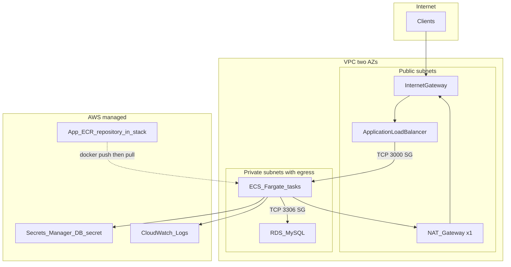
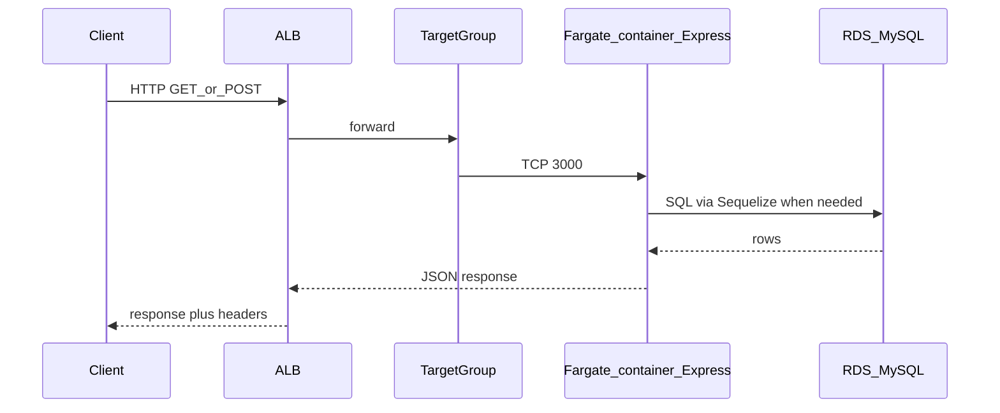
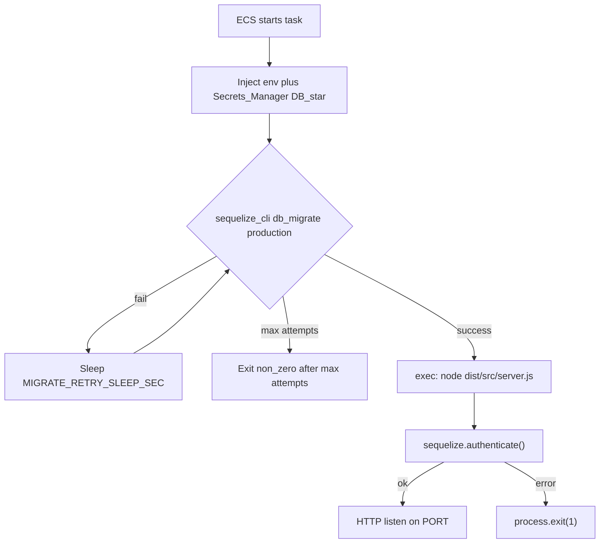
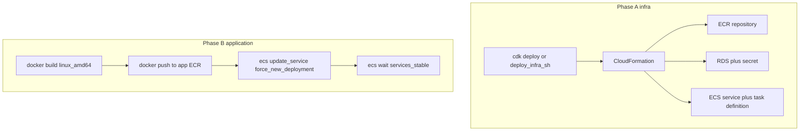

# Operational flows for the current code (`TeacherStudentStack`)

This document describes the **actual** CDK stack and API container behavior as implemented in:

- [`infra/cdk/lib/teacher-student-stack.ts`](../infra/cdk/lib/teacher-student-stack.ts)
- [`Dockerfile`](../Dockerfile) target `runtime` and [`scripts/docker-entrypoint.sh`](../scripts/docker-entrypoint.sh)
- [`src/server.ts`](../src/server.ts) (HTTP server starts after the database is reachable)

## Where diagrams live in the repo

| What | Location |
|------|----------|
| **Reference architecture image** (CloudFront, S3, Cognito, etc. — *target / extension*) | [`docs/images/aws-reference-architecture.png`](./images/aws-reference-architecture.png), embedded in [`aws-cognito-ecs-deployment.md`](./aws-cognito-ecs-deployment.md) |
| **Flows that match the current CDK + container** (renders on GitHub / GitLab) | **This file** — **Mermaid** diagrams below |

---

## 1. VPC topology and AWS components (as defined in the stack)

**Notes (from code):**

- **No** CloudFront, S3 frontend, or Cognito in the current CDK app.
- The stack creates an **`ecr.Repository`**; the task uses **`fromEcrRepository(..., ecrImageTag)`**. You **build and push** the image with [`scripts/aws/deploy-app.sh`](../scripts/aws/deploy-app.sh) (or CI) — see [aws-deploy-scripts.md](./aws-deploy-scripts.md).
- Fargate tasks have **no** public IP; outbound traffic (e.g. pull from ECR) uses the **NAT Gateway**.

---

## 2. HTTP flow: request to the API

ALB health check: **`GET /`** (that route does not query the DB; the process still required the DB to be up during bootstrap — see diagram 3).

---

## 3. Container lifecycle: from task start to listening

Details: [`scripts/docker-entrypoint.sh`](../scripts/docker-entrypoint.sh), then [`src/server.ts`](../src/server.ts).

---

## 4. Deploy flow: infrastructure then image (summary)

Phase **A** does not require Docker. Phase **B** requires Docker.

Automated sequence: [`scripts/aws/deploy-all.sh`](../scripts/aws/deploy-all.sh), or run [`deploy-infra.sh`](../scripts/aws/deploy-infra.sh) then [`deploy-app.sh`](../scripts/aws/deploy-app.sh). Details: [aws-deploy-scripts.md](./aws-deploy-scripts.md).

---

## Quick comparison: reference image vs current stack

| Component | [`aws-reference-architecture.png`](./images/aws-reference-architecture.png) | Current `TeacherStudentStack` |
|-----------|-----------------------------------------------------------------------------|--------------------------------|
| CloudFront + S3 | Yes (frontend) | **Not** in CDK |
| Cognito | Yes (auth) | **Not** in CDK; app does not verify JWT yet |
| ALB + ECS Fargate + RDS | Yes | **Yes** |
| Dedicated “app” ECR repo | Implied | **Yes** — stack-owned repo; **push** via script or CI |
| DB migrations | Outside app | **Yes** in container [`docker-entrypoint.sh`](../scripts/docker-entrypoint.sh) |

See also: [`aws-cdk-risks-and-mitigations.md`](./aws-cdk-risks-and-mitigations.md).
