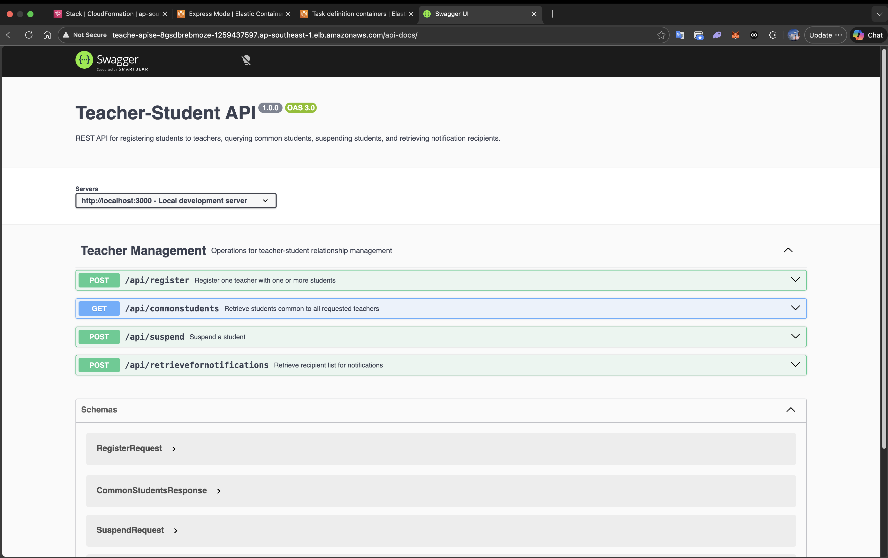
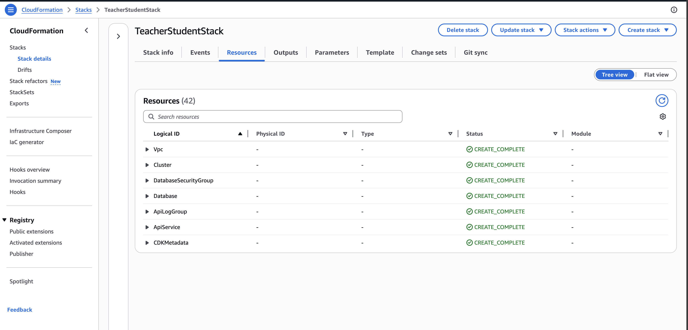
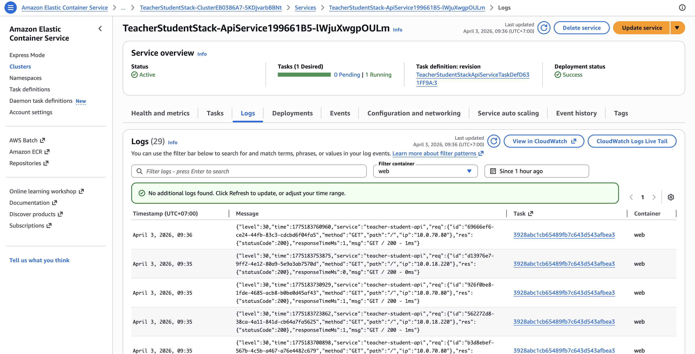

# Deployment screenshots

Screenshots from verifying the Teacher-Student API on AWS (Swagger UI, CloudFormation, ECS logs).

## Swagger UI — Teacher-Student API on ALB

OpenAPI documentation served at `/api-docs/` behind the Application Load Balancer.

## CloudFormation — TeacherStudentStack resources

Stack **TeacherStudentStack**, Resources tab: VPC, cluster, RDS, ECS service, log group, and related resources in `CREATE_COMPLETE`.

## ECS — API service logs

Amazon ECS service logs (container `web`): JSON application logs for `teacher-student-api` (e.g. `GET /` 200).

